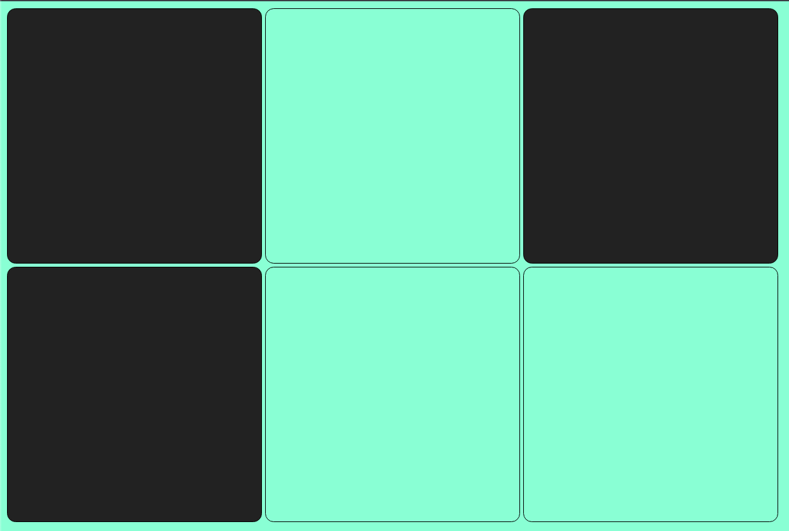
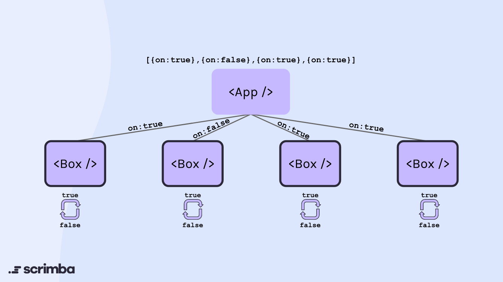
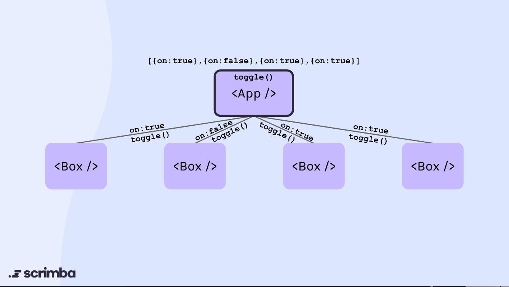

# Local State vs Unified State
- In this lesson, we'll make a little project to learn about `Local State` and `Unified State`.
- In this project, we have 6 instances of the `Box` component inside an `App`. Our goal is to make each box change from black to white and vice versa each time it gets clicked.

  

## Local State
- One way of allowing the user to flip color of each box by clicking on it is to use `local state`.
- The image below indicates that we create a new `state` inside each of our boxes and initialize each `state` based on the `incoming props` of `on`.

  

- This method is also called `Derived State`, but [You Probably Don't Need Derived State](https://reactjs.org/blog/2018/06/07/you-probably-dont-need-derived-state.html) since it is not the best practice.
- The `boxes-challenge-ver1` directory in this lesson is an example of using `local state` in this case.

## Unified State
- Instead of putting `states` and `setters` in each child component like we did before, what we can do is to make use of the `existing state` of the `parent component`.
- The image below indicates that we create a function called `toggle` inside the `parent component` and then pass that `toggle` function to each one of our `child component` instance. Then, anytime each Box gets clicked, it will run the `toggle` function and essentially tells App to update its `state`.

  

- The `boxes-challenge-ver2` directory in this lesson is an example of using `unified state` in this case.